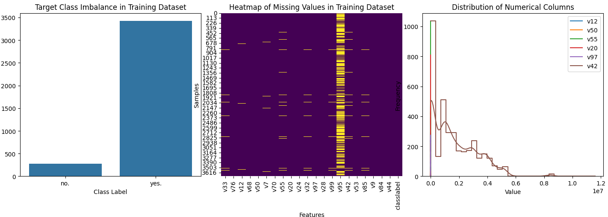
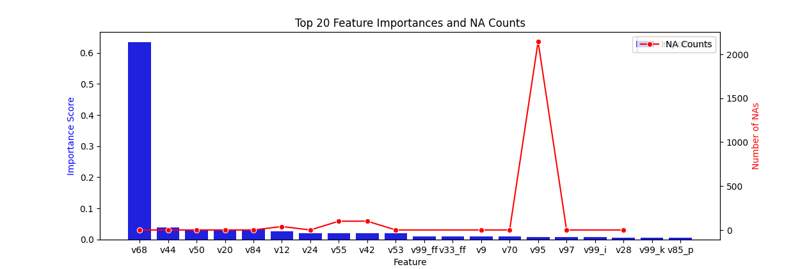
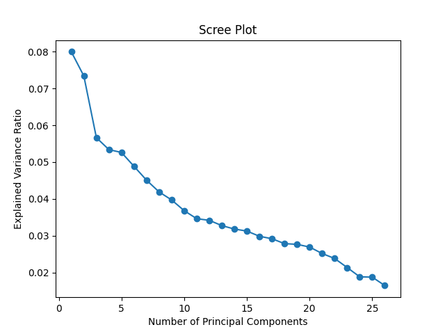
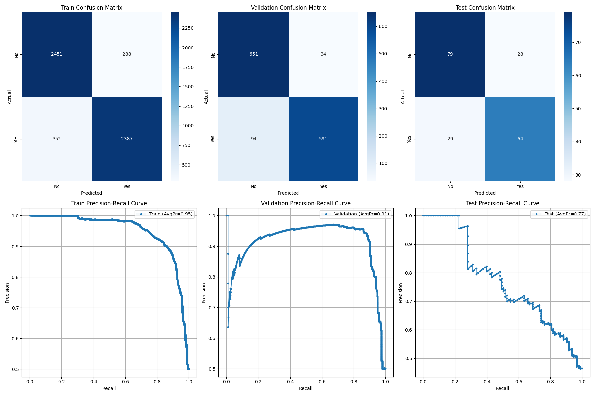

# Binary Classification Pipeline

As requested, I've implemented a binary classifier pipeline based on the provided "Training.csv" dataset.
As a preliminary note, out of the 3 datasets I've decided to use the "Training.csv" dataset to get a train and validation datasets from a 80/20 split.
I have used the "Validation.csv" dataset as the test data in this exercise.

## Exploratory Data Analysis

At first, I started by loading the data and performing some exploratory data analysis to understand the dataset's structure and characteristics. The dataset has a mix of numerical and categorical features:

- 13 categorical columns (object type)
- 6 numerical columns (float64)
- 3 integer columns (int64)

Some of the categorical variables, however, are binary (either 't' or 'f'), so I took that into account when encoding them. The target variable is binary, with two classes: 0 and 1.

## Data Preparation and Cleaning

Given that the dataset contained a mix of categorical, binary, and numeric features, my main goal was to ensure that all feature types were appropriately handled so that the models could effectively learn from them. The motivation behind this cleaning and transformation was to create a dataset that was uniform and consistent, reducing the risk of data inconsistencies affecting model performance. Clean data provides a solid foundation, enabling models to better capture meaningful patterns without being hindered by noise or improper formatting.

While performing exploratory data analysis, from a simple statistical analysis of the entire dataset, I spotted that one specific column ('v95') had a high percentage of missing values. As imputing these missing values could introduce bias, I decided to drop this feature from the training dataset, after assessing its low importance in the feature performance ranking, as done in the code in `prepare_data()`.

I also found that the labels in the training dataset were highly imbalanced, which is an issue I addressed later in feature engineering. 
Also, although some of the estimators I tested in the process of defining the binary classifier do not need categorical encoding, I decided to encode them anyway to ensure consistency across all models. I used `LabelEncoder` for binary-like columns and `OneHotEncoder` for categorical columns with more than two unique values, dropping the first column to avoid multicollinearity. One-hot encoding allows unique features to be treated separately, while an `OrdinalEncoder` did not seem appropriate as there was no clear ordering among the categories. For numeric values, I used median imputation to handle missing values, as it is robust to outliers.

Since the training and validation sets had different rows, I added missing rows to the validation set and imputed the missing values in the test set with 0.0.

## Feature Engineering and Scaling

After cleaning the data, I moved on to feature engineering. Using the `prepare_data()` function, I performed additional transformations, feature scaling, and the removal of highly correlated features. 

I used `StandardScaler` to ensure that the numeric features were on a similar range, which was particularly crucial for models that use distance metrics, such as SVM and K-Nearest Neighbors.

I also focused on addressing multicollinearity by removing highly correlated features. I calculated the correlation matrix and found that features with correlation coefficients greater than 0.75 were introducing redundancy, so I removed them. By doing so, I reduced model complexity and enhanced stability. 

In addition, I employed Principal Component Analysis (PCA) for dimensionality reduction when necessary. Scaling was important to bring all numeric features to a comparable scale, reducing the risk that a feature with a large range could disproportionately influence the model.
I ran a PCA test on the training dataset to detect the elbow point, which was between 4-5 PCA components when using the `StandardScaler`. This is shown in the scree plot below.

Another critical aspect of the pipeline was dealing with class imbalance. I noticed that the dataset was imbalanced, which could bias the model towards the majority class. To address this, I used the Synthetic Minority Over-sampling Technique (SMOTE) to generate synthetic examples for the minority class. Since the dataset contained categorical, binary, and numeric features, it was crucial to ensure consistency across these types when generating synthetic data points. By balancing the classes, my expectation was to ensure that the model learned an effective decision boundary for all classes, ultimately improving overall performance. I also tried downsampling the majority class, but the results were not as good.

## Classifier Selection and Hyperparameter Tuning

To create a flexible and robust solution, I implemented the `get_classifier()` function, which allowed me to try out several classifiers, including Logistic Regression, Perceptron, AdaBoost, Naive Bayes, SVM, K-Nearest Neighbors (KNN), XGBoost, and Random Forest. For each classifier, I defined a set of hyperparameters that I tuned using `GridSearchCV`.

- **Logistic Regression**: I expected it to provide a strong baseline, particularly because it is interpretable and well-suited for datasets with a mix of feature types. Its simplicity makes it computationally efficient and less prone to overfitting. This was a problem I detected with many other classifiers, where train and validation accuracy were quite high, but performance on the test dataset was poor, suggesting possible overfitting of the model. After tuning parameters like `C`, `penalty`, and `solver`, while its accuracy was not exceptionally high (72%), I found that Logistic Regression performed better than the other classifiers, capturing relationships within the data adequately and preventing overfitting, especially after feature scaling and balancing.

- **Perceptron**: I used this as a simple benchmark model. I tuned the penalty and regularization to ensure it captured meaningful relationships without overfitting. My expectation was that the Perceptron, like Logistic Regression, would provide a straightforward model that could capture the linear aspects of the data.

- **AdaBoost and Random Forest**: For these two ensemble methods, I did not expect feature scaling or PCA to be beneficial, as tree-based models are generally invariant to the scale of features. However, standardizing the input dataset and running PCA to keep 95% of the expected variance produced a slight improvement. My expectation was that these models would capture more complex relationships, especially among categorical features, due to their ability to create non-linear splits. I tuned the number of estimators to balance model complexity and generalizability.

- **Support Vector Machine (SVM)**: Given the dataset's mixed feature types, my expectation was that SVM would benefit from the reduced dimensionality provided by PCA, making it more computationally efficient. This was confirmed by the accuracy results of the prediction on the validation dataset, though no significant change was seen in the final results. I tuned the kernel type and regularization parameter `C` to achieve a good trade-off between bias and variance.

- **K-Nearest Neighbors (KNN)**: Since KNN is very sensitive to the magnitude of features, scaling was necessary. Additionally, PCA was used to reduce the feature space, making distance-based calculations more efficient. My expectation was that KNN would perform well with appropriate scaling and dimensionality reduction, especially given the numeric nature of many features.

- **Naive Bayes**: Naive Bayes neither requires scaling nor PCA, as it is based on the assumption of feature independence. I expected it to provide a fast, baseline model that works particularly well with categorical features, giving me a reference point for model complexity.

- **XGBoost**: XGBoost does not require scaling and typically does not need PCA. My expectation was that XGBoost would perform well on tabular data, capturing complex feature interactions due to its gradient boosting mechanism. I tuned parameters like the number of estimators, learning rate, and maximum depth to optimize its performance.

The `GridSearchCV` approach was computationally intensive but crucial for optimizing each model's hyperparameters. By doing so, I could identify the best model configuration to enhance generalizability. Having multiple classifiers enabled me to conduct a comprehensive comparative analysis and ultimately select the model that best suited the dataset's characteristics. I used cross-validation (5-fold) for all grid search tests.

## Model Training and Evaluation

Once I had cleaned and prepared the data, I split it into training, validation, and test sets. My reasoning was to keep enough data for training while ensuring sufficient validation data to provide reliable performance estimates, helping to avoid overfitting while evaluating the model's generalizability. In this specific case, I used the original "Validation.csv" set as the test dataset, with the "Training.csv" being split between train/validation datasets, following an 80/20 split ratio.

I then proceeded to train the models using the best hyperparameters identified through grid search. I evaluated each model's performance on the training, validation, and test sets by calculating accuracy metrics to get an initial idea of their effectiveness.

However, accuracy alone can be misleading, especially with imbalanced classes, so I also used the `classification_report()` function to evaluate precision, recall, and F1-score. These metrics were essential for understanding how well the models performed, particularly in minimizing false positives and false negatives.

- **Train accuracy**: 0.8831690397955458
- **Validation accuracy**: 0.9065693430656935
- **Test accuracy**: 0.715

### Classification Report for Logistic Regression

| Class         | Precision | Recall | F1-Score | Support |
|---------------|-----------|--------|----------|---------|
| 0.0           | 0.73      | 0.74   | 0.73     | 107     |
| 1.0           | 0.70      | 0.69   | 0.69     | 93      |
| **Accuracy**  |           |        | 0.71     | 200     |
| **Macro avg** | 0.71      | 0.71   | 0.71     | 200     |
| **Weighted avg** | 0.71   | 0.71   | 0.71     | 200     |

To better understand the model's predictive behavior, I also generated confusion matrices and precision-recall curves using the `plot_results()` function for the training, validation, and test sets. The confusion matrix provided a detailed view of true positives, true negatives, false positives, and false negatives, while the precision-recall curve illustrated the balance between precision and recall—especially important for understanding performance in imbalanced datasets.

- **Training Confusion Matrix**: True Negatives (TN): 2451, False Positives (FP): 288, False Negatives (FN): 352, True Positives (TP): 2387.
  The training set results indicate that the model has learned well overall, with a high number of correct classifications. However, the 288 false positives and 352 false negatives are worth noting. These errors, while not catastrophic, suggest that the model is not perfect at distinguishing between classes during training and still has some misclassifications.

- **Validation Confusion Matrix**: TN: 651, FP: 34, FN: 94, TP: 591.
  For the validation set, the results are still generally positive. The false positives and false negatives have decreased compared to the training set, which suggests the model is generalizing reasonably well, but the presence of 94 false negatives indicates there is still a risk of missing important positive cases. The model’s generalization at this point is acceptable, though it’s clear that some misclassifications are still occurring.

- **Test Confusion Matrix**: TN: 79, FP: 28, FN: 29, TP: 64.
  The test set performance shows a slight drop compared to training and validation, which is expected. The model is still performing reasonably well, with 64 true positives and 79 true negatives, but the 28 false positives and 29 false negatives suggest that its ability to generalize to completely new data isn’t as strong as I’d like. This indicates a need to further improve the model’s robustness.

The model’s false positives and false negatives remain manageable across the datasets, but the trend of increasing errors from training to test data suggests that generalization could be improved. While the current performance is acceptable, it’s certainly not without its limitations.
Overall, the model handles most cases well, but given the number of false negatives, particularly in the test set, it’s worth considering if reducing these errors should be prioritized, depending on the application.

- **Train Precision-Recall Curve**, Average Precision (AvgPr): 0.95 - The training curve looks quite good, showing high precision over a wide recall range. That said, the high average precision here could also be an indicator that the model might be overfitting slightly, and this strong result should be interpreted cautiously.
- **Validation Precision-Recall Curve**, AvgPr: 0.91 - There’s a slight drop compared to training, but still a decent score. The validation curve suggests the model is able to generalize fairly well, although the performance decrease compared to training shows that the model may have been a bit too optimized for the training data.
- **Test Precision-Recall Curve**, AvgPr: 0.77 - The drop in average precision for the test set is significant, indicating that the model struggles more when faced with truly unseen data. There is a noticeable loss in precision as recall increases, meaning that the model’s ability to balance these metrics deteriorates when moving away from the validation environment.

There is a substantial drop in average precision from training (0.95) to test (0.77), which points to potential overfitting. This means the model may have learned some details or noise that are specific to the training data. This isn’t catastrophic, but it’s something I need to address if I want a more reliable model. The number of false negatives remains higher than desired, particularly on the test set. Missing positive cases can be problematic if they carry significant cost. This performance is still acceptable but should be improved, especially if catching positives is crucial.
The precision-recall trade-off, especially on the test set, suggests the need for more tuning. The model maintains reasonable precision at lower recall values, but struggles at higher recall. It’s worth adjusting the decision threshold to find the right balance, but it’s also clear that the model isn’t as stable as I’d like in this trade-off. The differences in performance between training, validation, and test suggest that there might be some mismatch between the datasets, or perhaps the model’s complexity is too high. Cross-validation could help me understand whether these differences are due to the splits or some other underlying issue.

## Expectations

My objective was to develop a well-tuned, robust classification model capable of accurately predicting the target variable across training, validation, and test sets. By employing techniques like feature scaling, handling class imbalance, removing correlated features, hyperparameter tuning, and dimensionality reduction, I aimed to construct a model that generalizes well without overfitting.

The use of various evaluation metrics, including confusion matrices and precision-recall curves, allowed me to thoroughly assess each model's strengths and weaknesses. This comprehensive assessment facilitated targeted improvements, and by tuning hyperparameters, I could ensure model performance improvements. Ultimately, I selected the model that provided the highest accuracy while maintaining a balanced trade-off between precision and recall.

The model’s performance is acceptable at this stage, and it’s clear that it has learned to differentiate the two classes relatively well. However, there are some limitations—particularly the drop in performance from training to test and the presence of false negatives that need to be reduced. The results are a good starting point, but further tuning and improvements are needed to make this model more reliable for practical deployment.